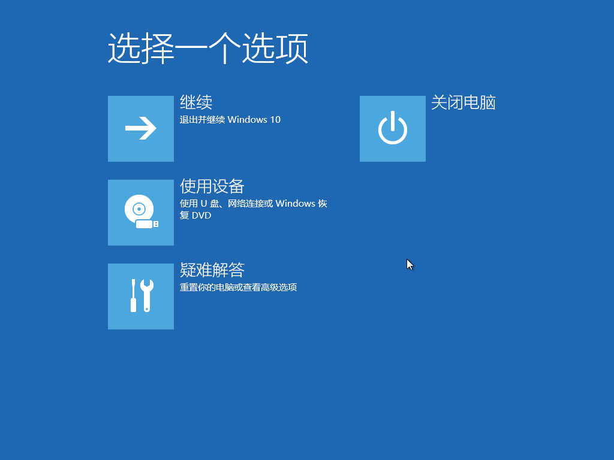
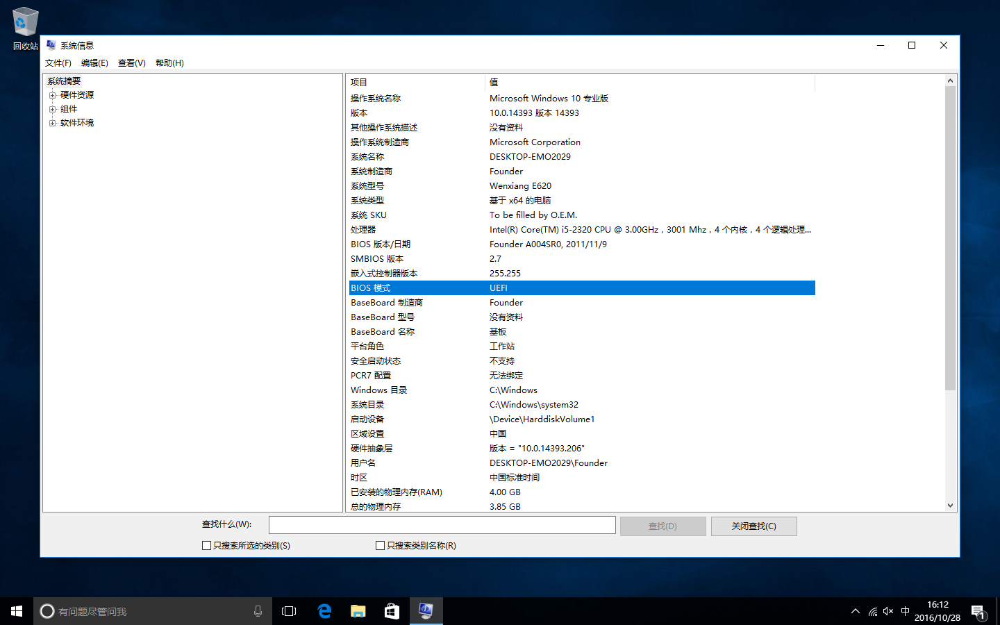
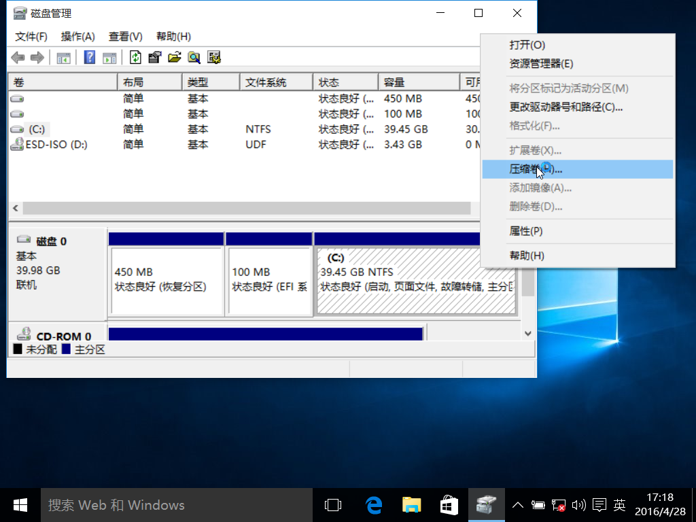
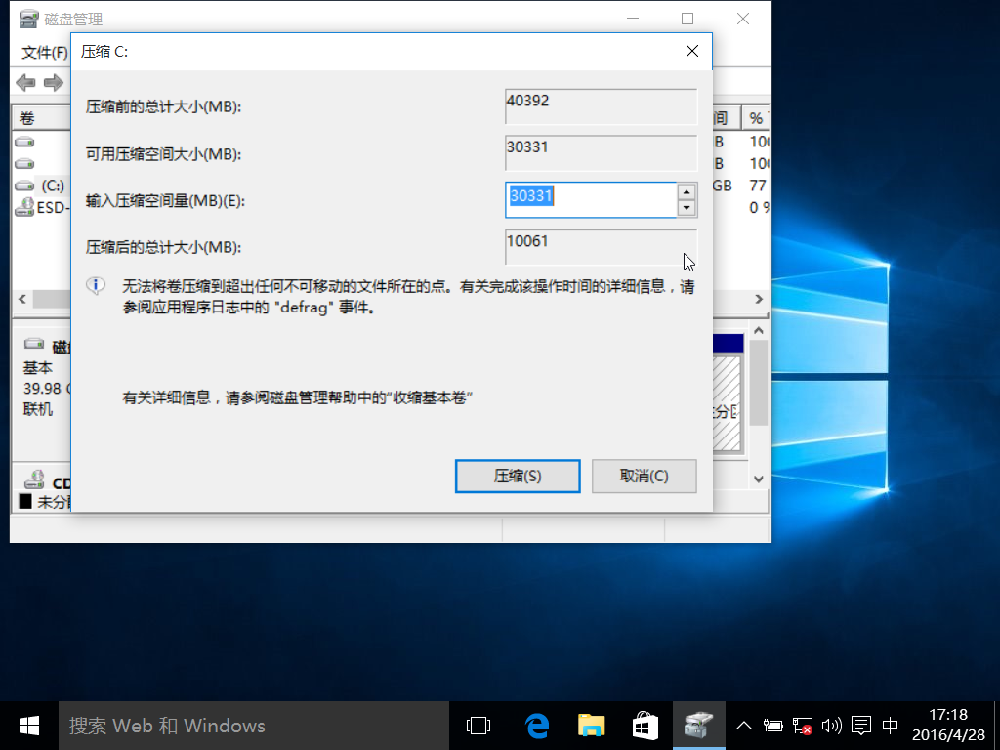
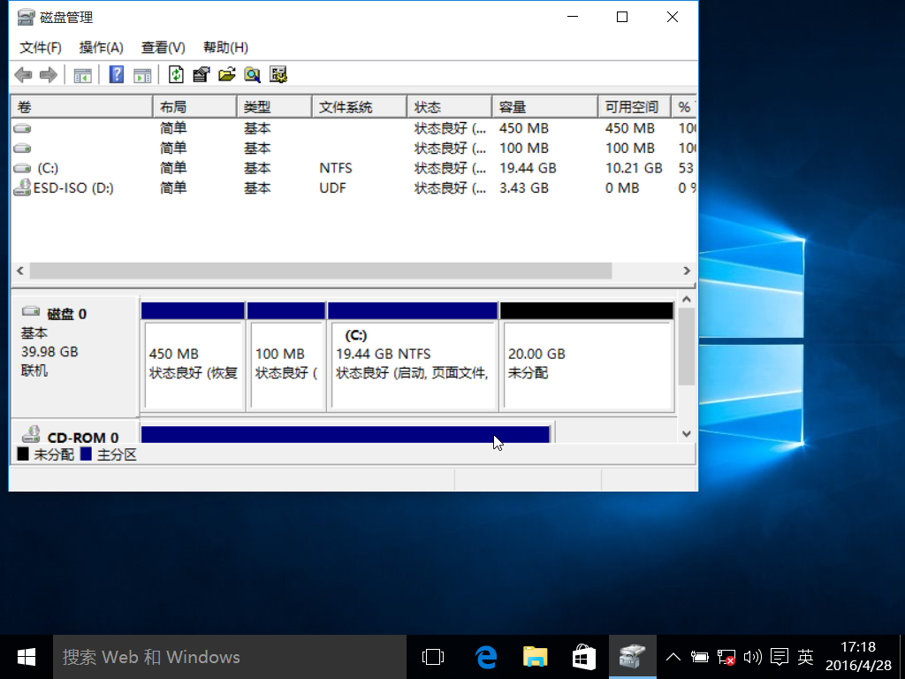

# 在 Windows 上准备安装 Arch GNU/Linux

> 其实条件允许的话，最好还是找一台电脑单独装（<s>双系统什么的最麻烦的啦~</s>）

确定启动类型
----------------------------------------

* 首先打开设置 ( Windows 8/8.1 叫做 "电脑设置"),然后通过 "更新和恢复" -> "恢复" -> "高级启动" 重启电脑.

如果是 UEFI 启动的话,大概是这个样子:

没错就是有个 "使用设备" 的选项 😂

* 或者同时按下键盘上的 Windows 徽标键（就是有 Windows 标志那个） 和 R 键，会打开“运行” 对话框。

在里面输入 :code:`msinfo32` 然后回车（按 Enter 键）确认，打开”系统信息”应用。

看“BIOS模式”里是不是 UEFI 😂😂，还有下面那个 “安全启动状态”是不是“以关闭”（咱这台电脑的 UEFI 太旧所以显示的是不支持）

    具体怎么关因为每种电脑的方法不一样于是汝要自己 STFW (Search the f**king Web，搜索一下) 了😂

* 再或者打开磁盘管理（Windows 8 以后的系统可以通过按下 Windows + X 的菜单里找到 “磁盘管理”）

嗯，大概就是这样子的呗 (虽然具体的磁盘分区可能和咱的不一样)

看汝的硬盘上有没有一个 EFI 系统分区 😂😂😂

在硬盘上准备一块空闲空间
---------------------------------------

这里拿来演示的是 Windows 7 以后都自带的 “磁盘管理” 程序，应该能解决大多数问题 \_(:з」∠)\_

* Windows 8 以后的系统可以通过按下 Windows + X 的菜单里找到 “磁盘管理”

* 嗯，大概就是这样子的呗 (虽然具体的磁盘分区可能和咱的不一样)

* 汝哪个硬盘分区比较空闲? 右键点击它,有一个"压缩卷的选项"

* 输入压缩的大小 \_(:з」∠)\_

* 然后就多了一块未分配的空间 😂

